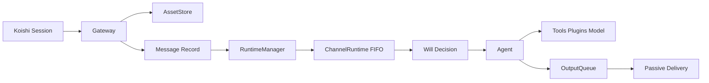

# YesImBot v4 官方文档

## 让语言模型自然融入群聊

YesImBot v4 是一套基于 Koishi 的 message-first Agent Runtime。它不再把每条消息都当成一次“提问”，而是按频道持续观察对话、判断何时回应，并通过工具和插件扩展行动能力。

## 核心能力

<strong>Message-first 运行时</strong>

消息按频道进入 FIFO，忙时加入当前 turn，避免多个模型流同时消费同一个频道上下文。

<strong>稳定的 Will 边界</strong>

routing 按私聊、提及和群聊决定 wait/trigger；willingness 提供可解释的意愿值与衰减模型。

<strong>插件与 Provider 生态</strong>

AgentPlugin 扩展工具、提示词和生命周期；Provider 只负责把 AI SDK 模型注册进 `ctx.yesimbot.model`。

<strong>本地可验证的会话与资源</strong>

频道目录保存 manifest、JSONL 会话、assets、artifacts、workspace 和插件数据，不依赖平台在线状态重放历史。

## 快速通道

<a class="quick-card" href="getting-started/quick-start.md"><strong>快速开始</strong>5 分钟完成基础配置并开始对话。</a>

<a class="quick-card" href="concepts/architecture.md"><strong>架构总览</strong>了解 Gateway、RuntimeManager、ChannelRuntime 与 agent-runtime 的边界。</a>

<a class="quick-card" href="reference/configuration.md"><strong>配置参考</strong>查看当前 v4 配置项与 `models.json` 用法。</a>

<a class="quick-card" href="plugins/index.md"><strong>插件总览</strong>浏览工作区、MCP、搜索、记忆和平台工具插件。</a>

<a class="quick-card" href="development/overview.md"><strong>开发指南</strong>开发 AgentPlugin、PlatformTranslator 与模型 Provider。</a>

<a class="quick-card" href="development/versioning.md"><strong>多版本文档</strong>使用 Mike 发布 v3 与 v4 等历史版本。</a>

## 数据流

## 项目信息

- 当前文档面向 `dev` 分支实现的 v4 架构。
- 代码仓库：[YesWeAreBot/YesImBot](https://github.com/YesWeAreBot/YesImBot)
- 文档仓库：[YesWeAreBot/AthenaDocsNG](https://github.com/YesWeAreBot/AthenaDocsNG)
- 许可证：MIT
